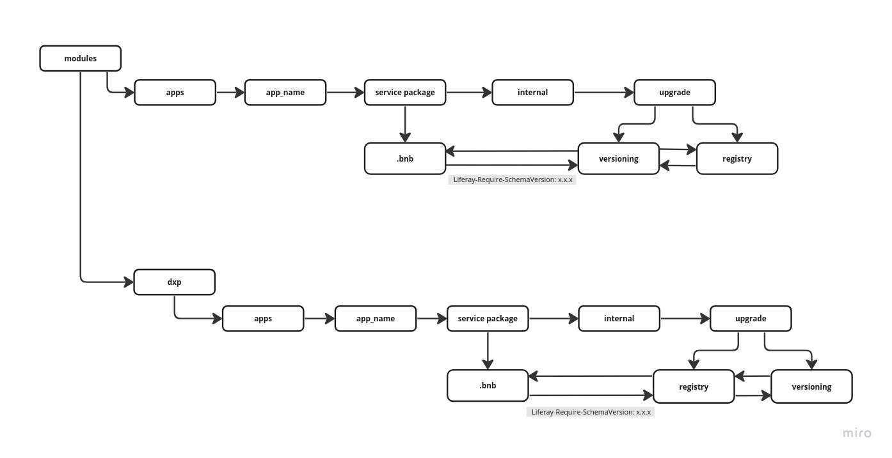

# Let me learn

### Artifacts about the upgrade process of database between versions of Lifaray.

#### Subjects that will discussed

- architecture
- database
- prepared statement lib
- java
- extends classes(UpgradeStepRegistrator and UpgradeProcess)
- regex
- tests

 
<h2>Architecture</h2>

Understand the architecture to use on new issues of process to keep the consistence, pattern of the code and assurence the working.

<h3>Model of the architecture in diagram</h3>

<h3>Folders architecture</h3>

For every app of Liferay, has your respective structure of the upgrade process. Generally stay on directory service/internal/upgrade

- examples
  - workflow: 
    - portal-workflow-metrics-service/src/main/java/com/liferay/portal/workflow/metrics/internal/upgrade
    - analytics/analytics-message-storage-service/src/main/java/com/liferay/analytics/message/storage/internal/upgrade    

<h2>Database</h2>

Understand the concepts of the database relational to execute query in process upgrade.

- examples
  - select
  - update
  - delete
  - join
  - alter table   
